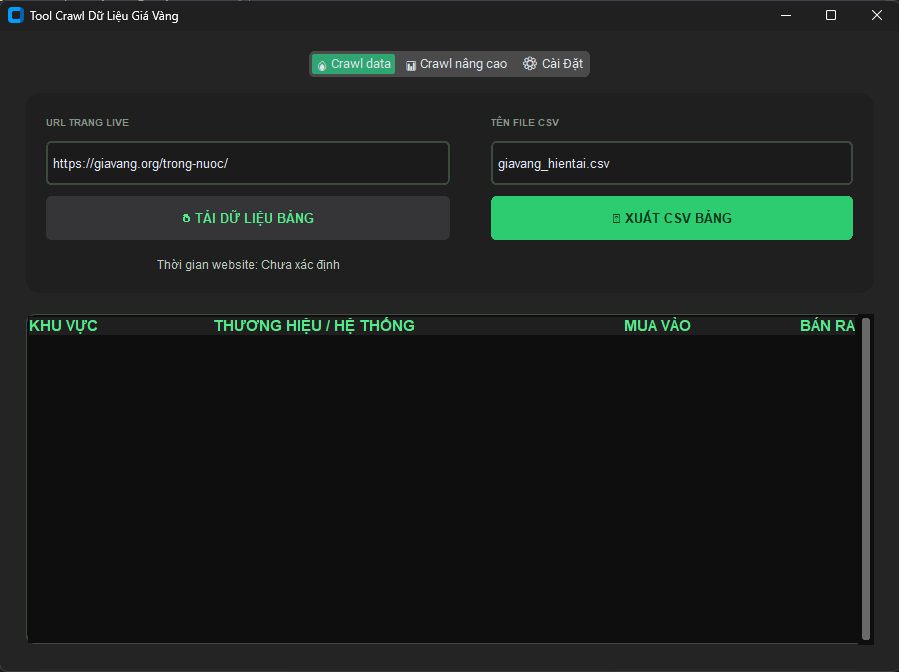

<div align="center">

# Gold Price Crawler - Ứng dụng cào dữ liệu giá vàng

<br/>

[](https://www.python.org/)
[](https://github.com/TomSchimansky/CustomTkinter)
[](https://www.crummy.com/software/BeautifulSoup/)
[](https://pandas.pydata.org/)
[](https://pypi.org/project/requests/)

</div>

---

## Giới thiệu dự án

> **Gold Price Crawler** là một ứng dụng được xây dựng để trích xuất dữ liệu giá vàng trực tiếp từ trang web [https://giavang.org/](https://giavang.org)

Dự án tập trung vào các tính năng cốt lõi:

- Giao diện UI/UX tối màu hiện đại, mượt mà nhờ **CustomTkinter**.
- Cào dữ liệu cực nhanh với kiến trúc xử lý **Đa luồng (Multi-threading)** bằng `concurrent.futures`.
- Thu thập cả dữ liệu trực tuyến (Live) và dữ liệu lịch sử (History) linh hoạt.
- Tự động chuẩn hóa và lưu trữ bảng giá vàng dưới dạng **CSV**.

---

<div align="center">

 <!-- Cập nhật ảnh chụp màn hình UI thực tế vào thư mục demo -->

</div>

---

## Kiến trúc hệ thống

```text
CrawlData/
├── core/                       # Lõi xử lý logic & Trích xuất dữ liệu
│   ├── config.py               # Cấu hình chung (AppConfig)
│   ├── manager.py              # Quản lý Đa luồng (ThreadManager)
│   ├── processor.py            # Parser cho trang Lịch Sử kiểu mẫu
│   ├── live_processor.py       # Parser cho trang Live hiện tại
│   └── worker.py               # Luồng làm việc độc lập của ThreadPool
│
├── ui/                         # Giao diện người dùng
│   ├── app.py                  # Cửa sổ chính chứa Tabview
│   └── tabs/                   # Các module tab riêng biệt
│       ├── live_tab.py         # Chức năng Crawl Data
│       ├── history_tab.py      # Chức năng Crawl Lịch sử (Nâng cao)
│       └── config_tab.py       # Chức năng cài đặt hệ thống
├── main.py                     # Entry point khởi chạy ứng dụng
└── requirements.txt            # Danh sách thư viện phụ thuộc
```

---

## Hướng dẫn cài đặt

#### 1. Clone repository

```bash
git clone <repository-url>
cd CrawlData
```

#### 2. Cài đặt môi trường ảo (Khuyến nghị)

```bash
python -m venv venv
# Đối với Windows:
venv\Scripts\activate
# Đối với MacOS/Linux:
source venv/bin/activate
```

#### 3. Cài đặt các thư viện phụ thuộc

```bash
pip install -r requirements.txt
```

#### 4. Khởi chạy ứng dụng

```bash
python main.py
```

---

<div align="center">
⭐Nếu project hữu ích, bạn có thể để lại một star trên GitHub.
</div>
